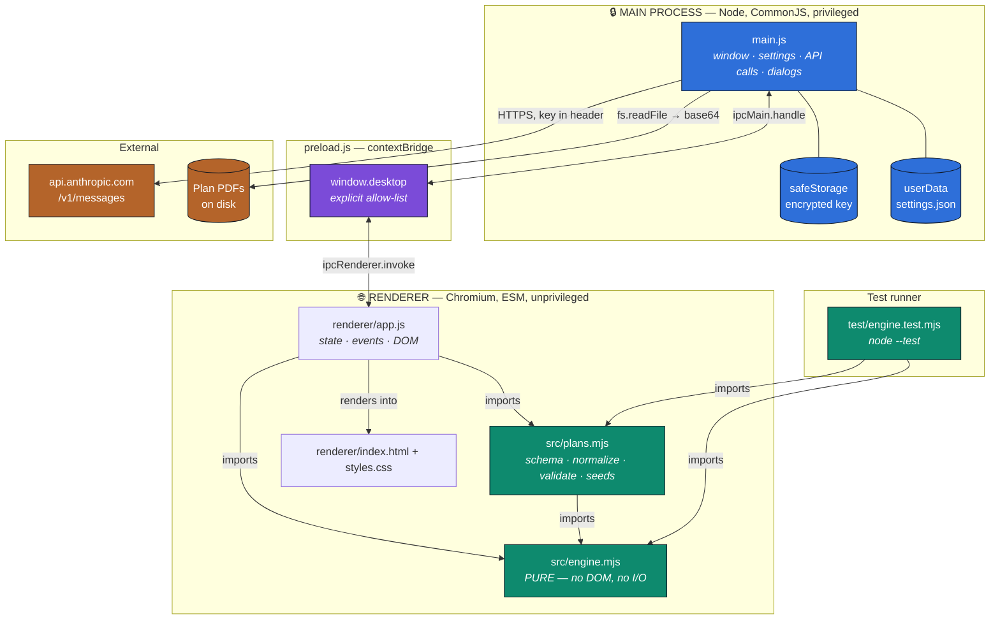
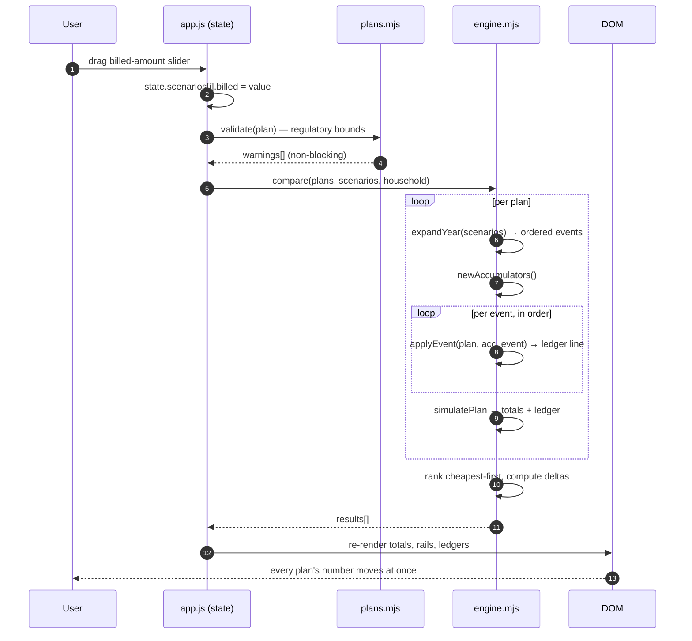
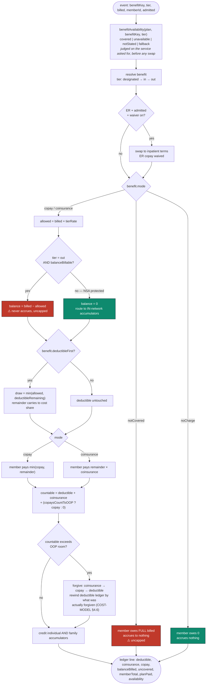
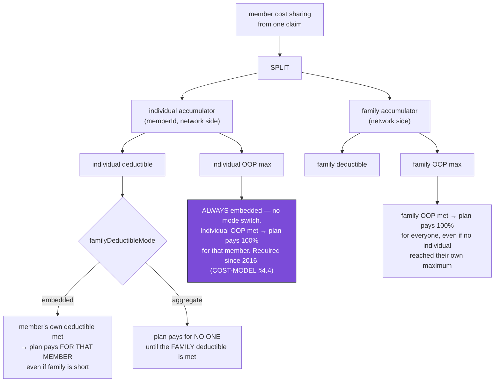
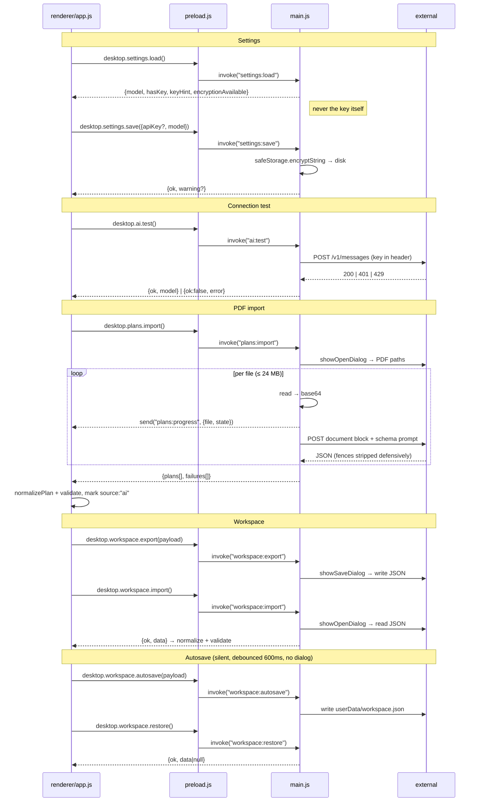
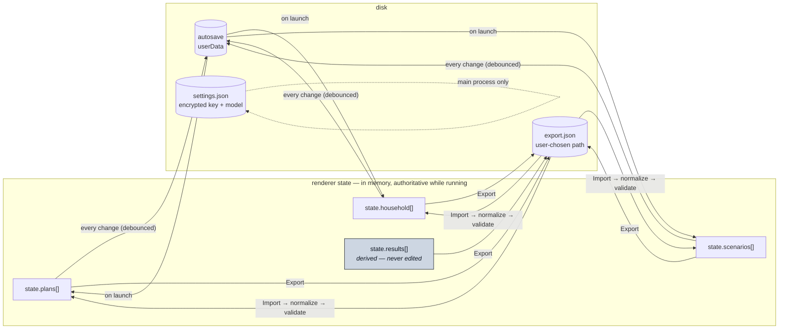

# Data flow and connection map — Plan Ledger

How data moves through the application, which module owns each hop, and where the trust
boundaries sit. Companion to [`ARCHITECTURE.md`](ARCHITECTURE.md) (structure) and
[`COST-MODEL.md`](COST-MODEL.md) (the math the pipeline performs).

Diagrams are Mermaid. IntelliJ, GitHub and VS Code render them inline.

---

## 1. Module connection map

Every arrow is a real dependency. If an arrow you want to add crosses the trust boundary
anywhere except through `preload.js`, the design is wrong.

**Read the colors:** blue is privileged, green is pure and testable, purple is the single
crossing point, orange is outside the app. The green blocks are the only ones that produce
numbers, and they can be exercised without launching Electron at all.

---

## 2. The recompute loop — the hot path

This runs on **every keystroke and every slider tick**. It is synchronous and touches nothing
outside the renderer, which is what makes dragging a slider and watching five plans re-rank feel
instant.

**Constraint:** no `await` anywhere in this loop. No IPC, no disk, no network. The moment
recompute becomes asynchronous, the slider stops feeling connected to the numbers, and the
slider is the product's main idea.

---

## 3. Pricing a single claim

The innermost step — `applyEvent`. Every one of the 17 engine tests ultimately lands here.
Order of operations is specified in [COST-MODEL §2.1](COST-MODEL.md#21-order-of-operations-on-a-single-claim).

The two red nodes are the uncapped ones — balance billing and non-covered services. They bypass
both accumulators entirely and are the reason the UI reports them on their own flagged rows
rather than folding them into a total.

The `notCovered` path is also why availability is computed *first*, at the top of the flow.
That branch produces a perfectly good number — the entire billed charge — and a number is
exactly the wrong thing to show. Beside another plan's `$40` copay it reads as a price rather
than as being on your own, so the renderer prints the word instead. COST-MODEL §2.7.

---

## 4. Accumulator hierarchy and roll-up

Every dollar of member cost sharing credits **two** ledgers: the member's and the family's.
Whichever ceiling is reached first starts the plan paying.

The purple node is the correction from COST-MODEL §4.4: the build prompt's single
`familyDeductibleMode` governs the **deductible only**. The individual out-of-pocket maximum is
embedded unconditionally, on every plan, including aggregate-deductible ones like ES2P.

Also flowing through this structure, per plan:

- **`combinedAccumulators`** — whether the `in` and `out` sides share ledgers or run separately.
- **`pharmacyDeductible`** — when set, `rx*` benefits draw against their own deductible and do
  **not** consume the medical one.
- **NSA-protected out-of-network claims** — routed to the **in-network** accumulators regardless
  of the above (COST-MODEL §4.1). This is what gives plan 5 (EPO, no out-of-network
  accumulators at all) somewhere to put an out-of-network ER claim.

---

## 5. IPC surface

The complete list. `preload.js` exposes these names and nothing else — no generic channel
passthrough.

**[as-built] channel names.** `workspace:export` / `workspace:import` are the dialog-backed
pair; `workspace:autosave` / `workspace:restore` are the silent local pair. `restore` resolves
`{ok:true, data:null}` rather than rejecting when no autosave exists, and the renderer wraps
the call in `try/catch` anyway — a failed restore costs the user their autosave, and must never
cost them the whole interface.

**The key never crosses the bridge.** `settings:load` returns a masked hint
(`sk-ant-…abcd`) and a boolean, never the value. `ai:test` and `plans:import` do their work
entirely in main and return results, not credentials.

**[as-built] `desktop.ui.setZoom` / `getZoom` are the one pair that never reach main.** They
call `webFrame` directly from the preload, because frame zoom is a property of this frame and a
round trip would buy nothing. Still named, single-purpose, and logic-free. The preference itself
*is* persisted through main, as `textScale` on `settings:load` / `settings:save`, alongside the
model — it is an app setting, not workspace data, so it never lands in an exported comparison.

---

## 6. State ownership and persistence

Two rules:

1. **`state.results` is derived and never edited.** It is thrown away and rebuilt on every
   recompute. Anything that needs to persist belongs in plans, household, or scenarios.
2. **Settings never mix with workspace data.** The encrypted key lives in the main process's
   `settings.json`; exported workspace files are plain JSON containing no secrets, safe to
   email to a spouse or an HR rep.

---

## 7. Trust boundaries, summarized

| Boundary | Crossed by | Carries | Never carries |
|---|---|---|---|
| Renderer ↔ Main | `preload.js` allow-list only | plan data, settings metadata, progress events | the API key, raw fs handles, arbitrary channel names |
| Main ↔ Anthropic | `fetch` in main | base64 PDF, extraction prompt, key header | anything the user didn't explicitly import |
| Main ↔ Disk | `fs` in main | encrypted key, autosave, exports | plaintext key (unless `safeStorage` is unavailable — and then the UI says so) |
| Engine ↔ everything | function calls | plain objects in, plain objects out | side effects of any kind |
